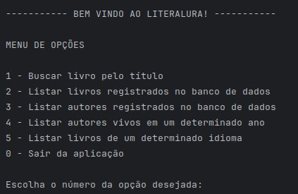

# LITERALURA
Trata-se da solução do Challenge proposto pela Alura no Programa Oracle Next Education - ONE - Turma G8.
Consiste no desenvolvimento de um programa de uma biblioteca pessoal, em que os dados dos livros podem ser recuperados através da [GutendexAPI](https://gutendex.com/).
As informações oriundas da API, são modeladas usando Spring Boot, Postgresql e JPA.

## Funcionalidades
O programa funciona através da linha de comando, em que os usuário interage com a aplicação através de um menu de opções e inserindo o número correspondente à opção desejada.

* **1 - Buscar livro pelo título:** O usuário informa um nome de um livro para a busca. Os dados são obtidos a partir da API e o resultado da busca é apresentado ao usuário. Também é feita a conferência se o autor/livro já está armazenado no banco de dados, com o armazenamento no banco, se necessário.
* **2 - Listar livros registrados no banco de dados:**  Retorna todos os livros que foram armazenados no banco de dados após a utilização da função 1. 
* **3 - Listar autores registrados no banco de dados:**  Retorna todos os autores que foram armazenados no banco de dados após a utilização da função 1.
* **4 - Listar autores vivos em um determinado ano:**  Filtra todos os autores armazenados no banco de dados que estejam vivos em um determinado ano a ser informado pelo usuário.
* **5 - Listar livros de um determinado idioma:** Filtra todos os livros armazenados no banco de dados e que tenham o idioma informado pelo usuário, através da sigla desse idioma.
* **6 - Encerrar aplicação:** Finaliza a execução do programa.

[Clique aqui para assistir um vídeo demonstrativo da aplicação](media/Literalura.mkv)

## Tecnlogias utilizadas
* Java 21
* Spring Boot
* Spring JPA
* PostgreSQL

